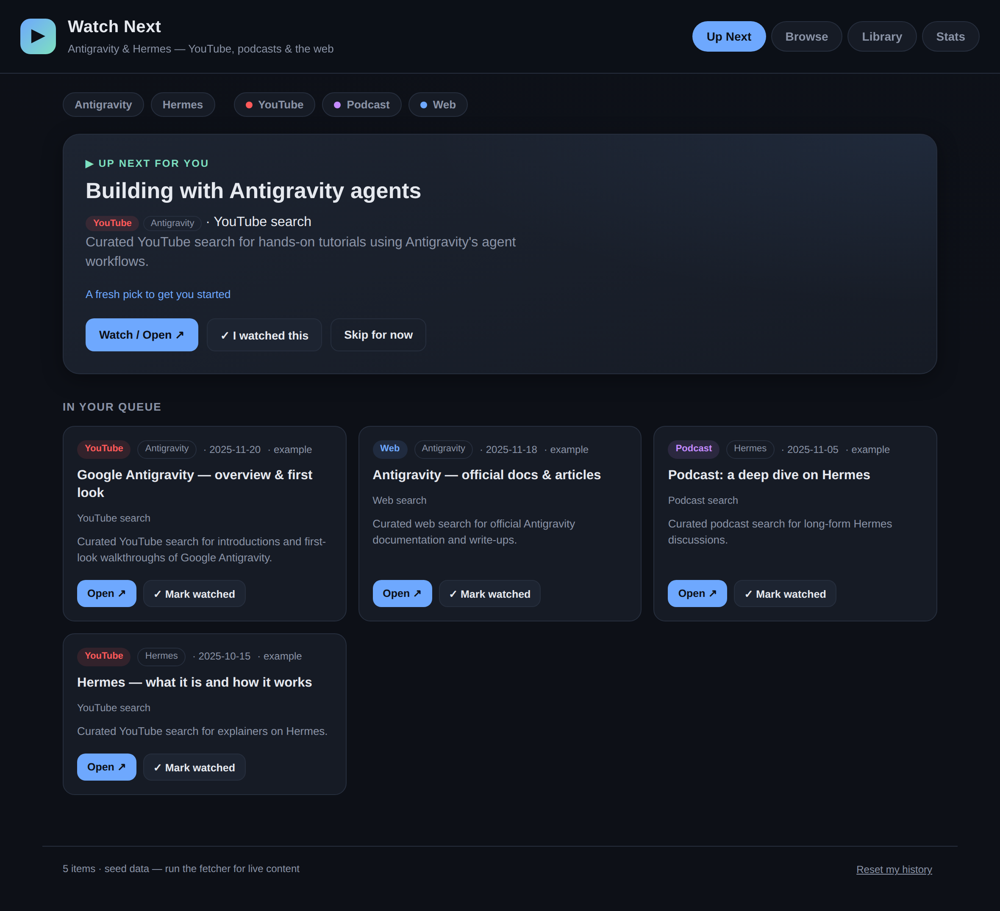

# Antigravity & Hermes — Watch Next

A personal tracker and recommender for **Antigravity** and **Hermes** material
across **research papers, blogs, Hacker News, podcasts and video**. It shows you
what to read or watch next, and when you mark something done it asks whether you
**liked it** — then uses your 👍 / 👎 to sharpen future picks.

**Live site:** https://avnit.github.io/hermes-watchlist/



## Five sources, only one of them video

| Source | Where it comes from | Needs a key? |
|---|---|---|
| **Papers** | [Hugging Face Papers](https://huggingface.co/papers) — search + the Daily Papers feed | no |
| **Hacker News** | the public [Algolia](https://hn.algolia.com/api) API — stories linking out to blogs and articles | no |
| **Web** | blog and docs pages you list, scraped for on-topic links | no |
| **Podcasts** | RSS feeds you list | no |
| **YouTube** | YouTube Data API v3 | yes, `YOUTUBE_API_KEY` |

Four of the five need no credentials, so a fresh clone produces a useful catalog
with no setup. YouTube is opt-in and is deliberately no longer the centre of
gravity — see *Looking past any one platform* below.

Two tabs are dedicated views:

- **Papers** — research papers, most-upvoted first, each linking to both the
  Hugging Face page and the arXiv preprint.
- **Hacker News** — the latest blogs and articles, newest first, each opening the
  article with a second link straight to the discussion thread.

## How it works

```
 sources.json ──► fetch_media.py ──► catalog.json ──► web app
  (where to look)    (aggregator)      (the content)   (Up Next / Papers / Hacker News /
                                                        Browse / Library / Stats)
```

- **No backend, no database.** The app is static HTML/CSS/JS. Your history is
  stored in your browser's `localStorage`, so it stays on your device.
- **The recommender** ranks unread items by your taste: topics, sources and
  creators you've 👍'd score higher; 👎'd ones score lower; newer items get a
  recency boost. The top pick appears as the **Up Next** hero with a short
  "recommended because…" explanation.
- **The done → liked loop:** mark an item read/watched/listened (on the hero or
  any card) and it moves to your **Library** with a "Did you like it?" prompt.
  Rating it feeds straight back into the ranking.

### Looking past any one platform

Two things stop a single platform dominating:

1. **The catalog itself is mostly not video.** Papers, Hacker News, blogs and
   podcasts are first-class sources with their own fetchers, and the aggregator
   runs them before YouTube.
2. **A variety nudge in the ranking.** Once you have a little history, sources
   you've consumed *less* than average get a score bump, so bingeing one platform
   pushes the rest of your queue toward the others. The bump scales with how much
   history you've built (capped), because source affinity grows with every rating
   — a fixed-size nudge gets swamped after two or three likes and stops doing
   anything. Consume evenly and the term is ~0 whatever you rate, so it only
   bites when your history is genuinely lopsided, and it tilts rather than
   vetoes: a source you keep 👍-ing still wins.

The **Stats** tab shows both: what the catalog is made of, and what you actually
consume.

## Run it locally

The app must be served over HTTP (browsers block `fetch` of local files over
`file://`).

```bash
./scripts/serve.sh          # serves on http://localhost:8000/
# or:
python3 -m http.server 8000 # then open http://localhost:8000/
```

It ships with **seed data** — real papers, real posts and real Hacker News
threads — so it is useful immediately. Run the fetcher to replace it with live
content.

## Pulling live content

1. Edit **`data/sources.json`**:
   - `papers.queries` — what to search on Hugging Face Papers; `include_daily`
     also sweeps the Daily Papers feed
   - `hackernews.queries` — what to search on Hacker News; `blogs_only` keeps
     stories that link to an article and drops Ask/Tell HN text posts;
     `min_points` and `max_age_days` set the quality and recency floor
   - `websites.pages` — blog/docs pages to scrape links from
   - `podcasts.feeds` — podcast RSS feed URLs
   - `youtube.search_terms` / `youtube.channel_ids` — set `"enabled": false` to
     drop video entirely
   - `match` — regexes that tag an item **Antigravity** and/or **Hermes**, plus
     an `exclude` list (needed because "Hermes" also means a fashion house and a
     parcel courier)
2. *Optional, YouTube only* — get a free **YouTube Data API v3** key (Google
   Cloud Console → enable *YouTube Data API v3* → create an API key):
   ```bash
   export YOUTUBE_API_KEY=your_key_here
   ```
3. Run the fetcher (Python 3.9+, **no third-party packages required**):
   ```bash
   python3 scripts/fetch_media.py     # writes data/catalog.json
   ```
   Commit the updated `data/catalog.json` and push — Pages redeploys automatically.

Each source degrades gracefully — a missing API key, a disabled source or an
unreachable feed is skipped with a warning, and the other sources still run.

### Keep it fresh automatically

Run the fetcher on a schedule (a cron entry, or a scheduled GitHub Action) and
commit the refreshed `data/catalog.json`. Because papers, Hacker News, web and
podcasts need no credentials, a scheduled job needs no secrets unless you want
YouTube in the mix.

## Tests

**Aggregator** — parsing, topic matching, filtering and de-duplication. Each
source's HTTP layer is stubbed with a recorded-shape payload, so these run
anywhere with no network, and they also assert the shipped `data/catalog.json`
stays loadable by the app:

```bash
python3 scripts/test_fetch_media.py     # stdlib only
```

**Web app** — the six views, the per-source sort orders, the read → rate →
recommend loop, and the variety nudge, driven in a real Chromium page:

```bash
node scripts/test_app_browser.js
```

Playwright is an **optional** dev dependency — this repo otherwise needs no
third-party packages, so if it isn't installed the browser suite reports
`SKIPPED` and exits 0 rather than failing. To enable it:

```bash
npm i -D playwright && npx playwright install chromium
```

The variety nudge is verified against a purpose-built catalog (equal items per
source, one topic, one date) rather than the shipped one, because the shipped
catalog's topic and recency signals swamp it — a test that passes whether or not
the feature exists is worse than no test.

## Hosting (GitHub Pages)

This repo deploys to **https://avnit.github.io/hermes-watchlist/** via
`.github/workflows/pages.yml`. The workflow assembles a clean `_site/`
(the app + `data/`) and publishes it on every push to `main` (or via manual
*Run workflow*).

One-time setup: **Settings → Pages → Build and deployment → Source: GitHub
Actions**.

## Project layout

```
index.html          # app shell (Up Next / Papers / Hacker News / Browse / Library / Stats)
app.js              # recommender + variety nudge + done/liked flow + localStorage
styles.css          # dark UI
data/
  sources.json      # where to look + topic-matching rules  (you edit this)
  catalog.json      # aggregated items the app reads         (fetcher writes this)
scripts/
  fetch_media.py       # papers + Hacker News + web + podcast + YouTube aggregator (stdlib only)
  test_fetch_media.py  # offline tests for the aggregator
  test_app_browser.js  # browser smoke tests (Playwright optional)
  serve.sh          # convenience local server
.github/workflows/
  pages.yml         # deploys to GitHub Pages
```

## Privacy

Your history and ratings never leave your browser. There is no analytics, no
account, and no server call other than fetching the static `catalog.json`.

## License

MIT — see [LICENSE](LICENSE).
